[← Back to all projects](../README.md)

# 🏢 BrokerOS KPI

### Standup & Performance Management System

A production-ready, full-stack HR and KPI platform built for a broker office.
Manages attendance, tasks, standups, leaves, feedback, holidays, KYC, inventory, and performance scoring — all in one place.

> 🔒 Source code is private. Available for licensing — [get in touch](#-contact).

---

## 📸 Screenshots

### Dashboard

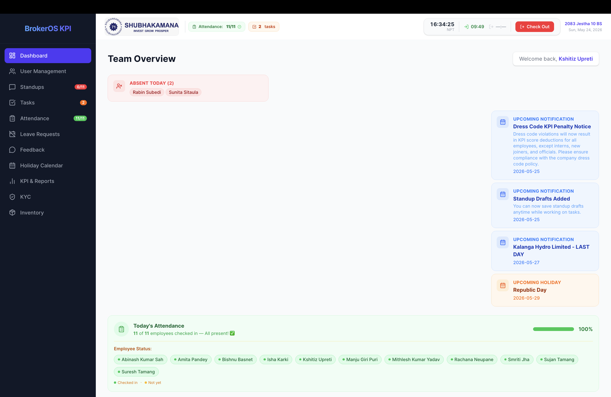

### Attendance Overview

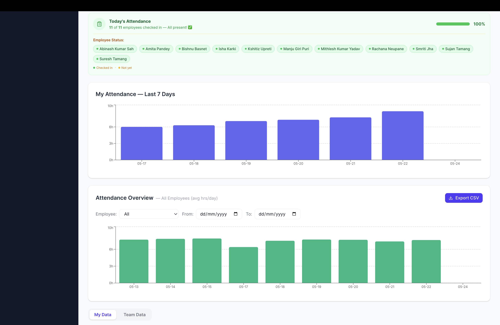

### Task Management

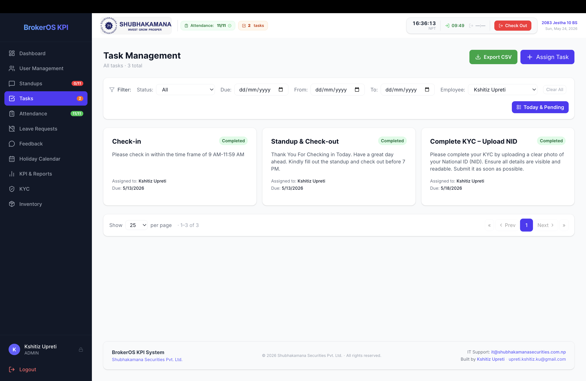

### Daily Standups

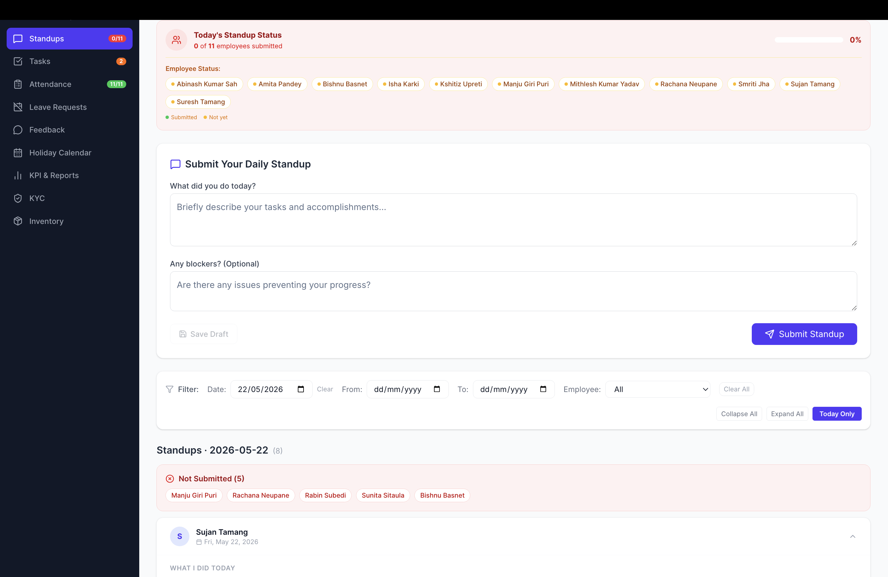

### Attendance Records

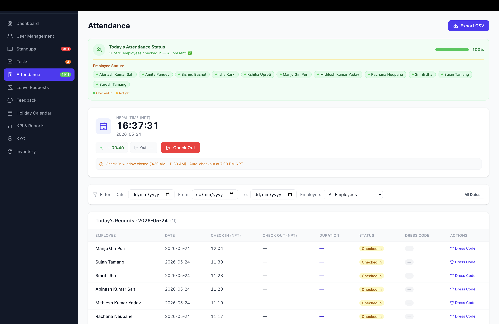

### Leave Requests

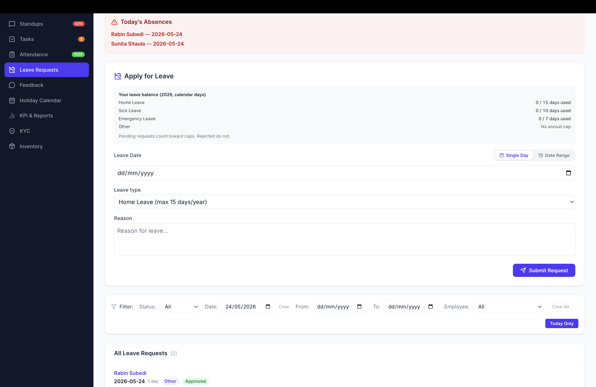

### KPI Leaderboard

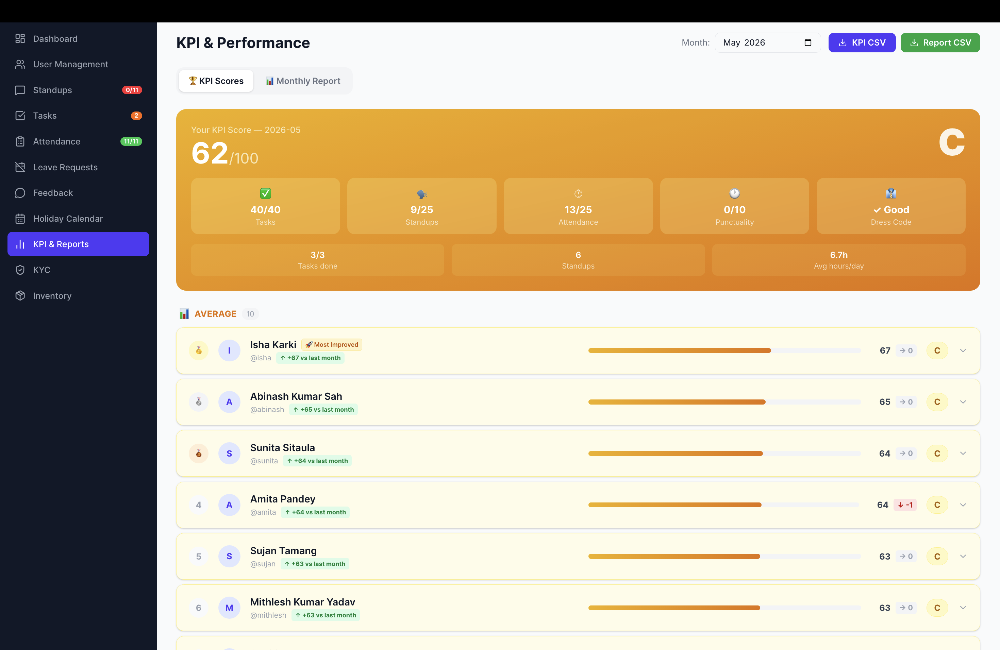

### KPI Monthly Report

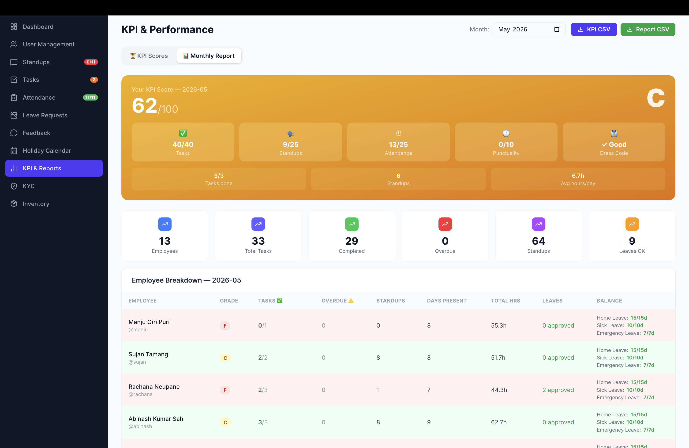

### Holiday Calendar

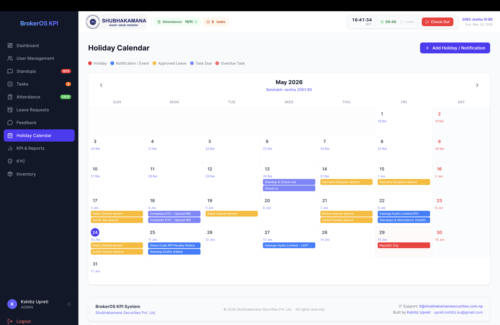

### Feedback & Suggestions

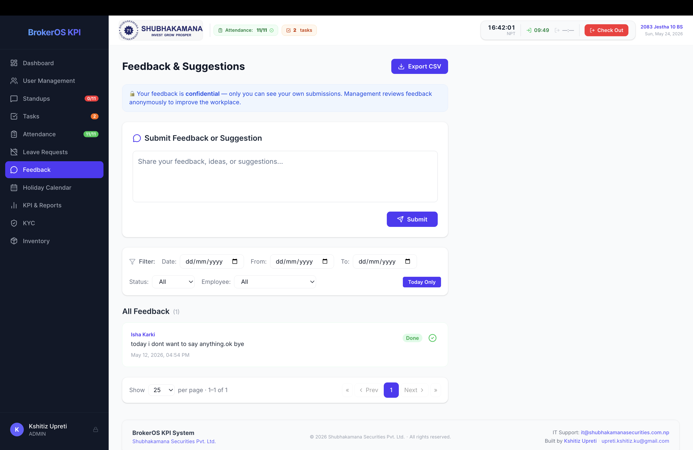

### KYC Management

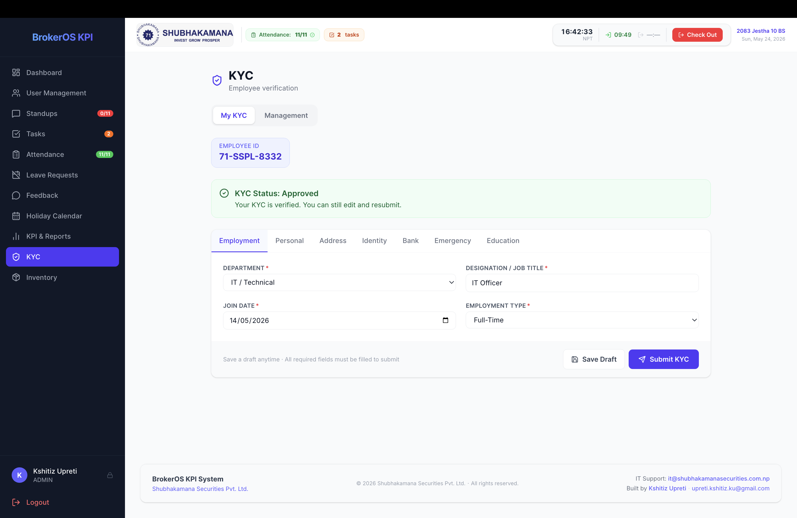

### Inventory & Stock

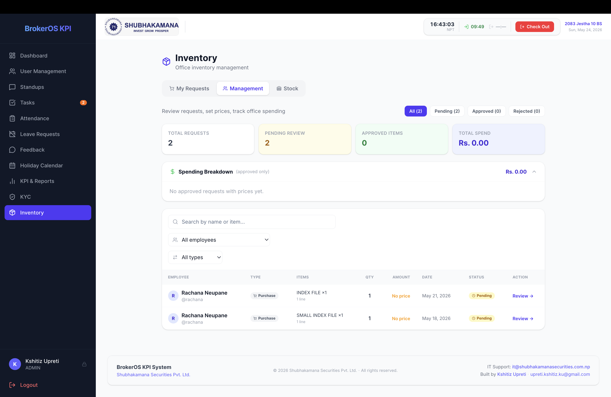

### User Management

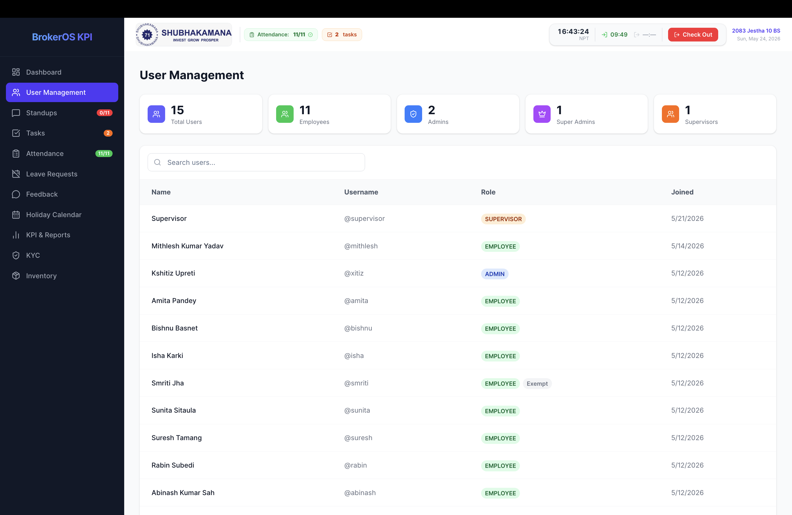

---

## ✨ Features

### 🏠 Dashboard

- Live Nepal Time (NPT) clock with real-time tick
- Employee check-in / check-out with today's times displayed in the header
- Attendance bar chart — last 7 days hours worked per employee
- Admin attendance overview chart with employee filter and date range
- Export attendance data as CSV directly from dashboard
- Absent Today and Upcoming Absences panels
- Task status distribution pie chart and standups trend bar chart
- Sidebar badges for pending tasks, leaves, feedback, and today's standup/attendance status

### ✅ Task Management

- Admins assign tasks with title, description, and due date — email sent to employee on creation
- Employees mark tasks as Completed or request Extension with a reason
- Employees create personal self-assigned tasks for their own KPI tracking
- Tasks flow through Pending → Completed → Pending Approval → Done
- Filter by status, due date, date range, and employee — export as CSV

### 🗣 Daily Standups

- One standup per calendar day per employee (enforced at API level)
- Submission blocked if employee hasn't checked in for the day
- Not-Submitted panel shows who hasn't submitted today (excludes users on approved leave)
- Collapse / expand individual standups or all at once — export as CSV

### 🕐 Attendance

- Check-in window: 9:30 AM – 11:30 AM Nepal Time only
- One check-in and one check-out per Nepal calendar day enforced
- Check-in blocked if employee has a pending/approved leave covering today
- Dress code status tracked per day — admins can edit via modal
- Auto-checkout cron job at 5:30 PM NPT for employees who forgot
- Not-Checked-In panel, export as CSV

### 📅 Leave Requests

- Apply for leave with date range, type (Home/Sick/Emergency/Other), and reason
- One-click email approve/reject via JWT-signed links embedded in notification emails
- Emails sent to all admins/superadmins on new leave request
- Approved absences shown as banners on Dashboard and Leave page — export as CSV

### 💬 Feedback & Suggestions

- Employees submit open-ended feedback anytime
- Admin/SuperAdmin marks each item as Done or Undone — export as CSV

### 📆 Holiday Calendar

- Full month calendar with color-coded events:
  - 🔴 Holidays, 🟡 Approved leaves, 🔵 Task due dates, 🔴 Overdue tasks
- SuperAdmin adds/deletes holidays and events — click any day for a detail popover

### 🏆 KPI & Reports

KPI score calculated monthly per employee (0–100):

| Category          | Max Points | How Calculated                                                          |
| ----------------- | ---------- | ----------------------------------------------------------------------- |
| Task Completion   | 40         | `(completed tasks / total due this month) × 40`                         |
| Standup Frequency | 25         | `(standups submitted / working days) × 25`                              |
| Attendance Hours  | 25         | `(hours worked / expected at 8h/day) × 25`                              |
| Punctuality       | 10         | `(days before 9:30 AM / days present) × 10` minus dress code violations |

| Grade | Score    |
| ----- | -------- |
| A     | 85 – 100 |
| B     | 70 – 84  |
| C     | 55 – 69  |
| D     | 40 – 54  |
| F     | 0 – 39   |

- Full ranked leaderboard with expandable per-employee breakdowns
- Monthly report with company-wide summary — month picker for historical data
- Export KPI scores and monthly report as CSV

### 🔐 KYC

- Employees submit employment, personal, identity, bank, emergency, and education details
- Upload citizenship front/back images via Cloudinary
- Admin/Supervisor can review, approve, or reject submissions

### 📦 Inventory & Stock

- Employees submit purchase or stock requests
- Stock item catalog with quantity, unit, and low-stock threshold alerts
- Approved requests auto-deduct from stock — snapshot records preserve historical data

### 👥 User Management & Security

- Role-based access: `SUPER_ADMIN`, `ADMIN`, `SUPERVISOR` (read-only), `EMPLOYEE`
- JWT stored in HttpOnly cookies — change password from sidebar
- All mutation endpoints blocked server-side for Supervisor role
- Middleware guards all dashboard routes

---

## 🛠 Tech Stack

| Layer          | Technology                                                    |
| -------------- | ------------------------------------------------------------- |
| Frontend       | Next.js 16 (App Router), Tailwind CSS, Recharts, Lucide Icons |
| Backend        | Next.js API Routes, Edge-compatible JWT Middleware            |
| Database       | MongoDB Atlas (Mongoose ODM)                                  |
| Authentication | JWT in HttpOnly Cookies                                       |
| Email          | Nodemailer via Microsoft Outlook SMTP                         |
| Storage        | Cloudinary (KYC document images)                              |
| Export         | PapaParse (CSV)                                               |
| Cron           | cron-job.org (auto-checkout at 5:30 PM NPT)                   |
| Deployment     | Vercel                                                        |
| Timezone       | UTC stored, Nepal Time (UTC+5:45) displayed                   |

---

## 👥 Roles

| Role          | Access                                                                      |
| ------------- | --------------------------------------------------------------------------- |
| `SUPER_ADMIN` | Full access — manage all users, approve/reject everything, delete records   |
| `ADMIN`       | Manage employees, assign tasks, approve leaves — cannot manage other admins |
| `SUPERVISOR`  | Read-only — view all data, export CSV, review KYC — cannot submit or edit   |
| `EMPLOYEE`    | Submit standups, check in/out, apply for leave, add tasks, view own KPI     |

---

## 📩 Contact

> Interested in deploying this system for your company?

- 📧 [upreti.kshitiz.ku@gmail.com](mailto:upreti.kshitiz.ku@gmail.com)
- 🌐 [kshitizupreti.com.np](https://kshitizupreti.com.np)
- 📱 +977 9869547209
- 💬 [WhatsApp](https://wa.me/9779869547209)

---

[← Back to all projects](../README.md)
