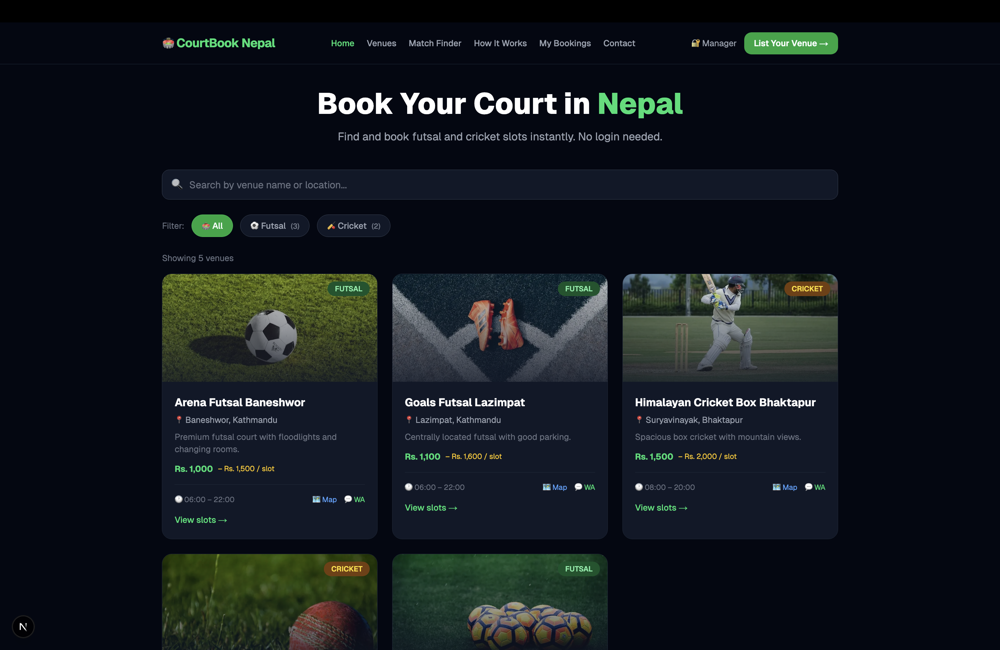
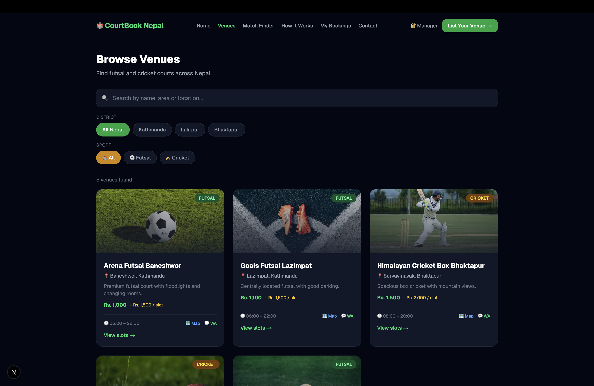
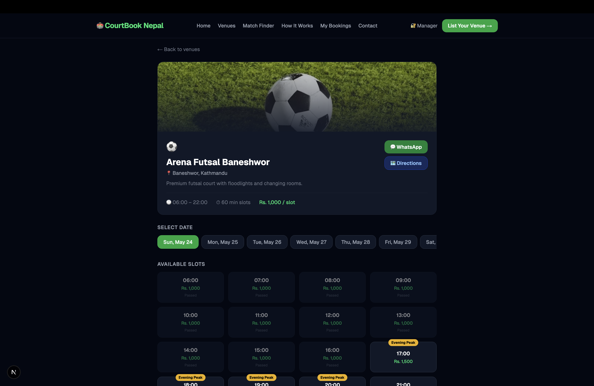
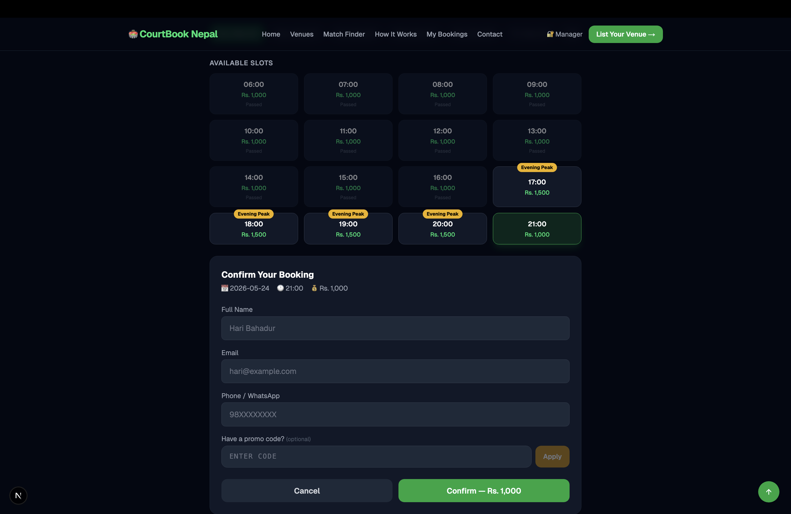
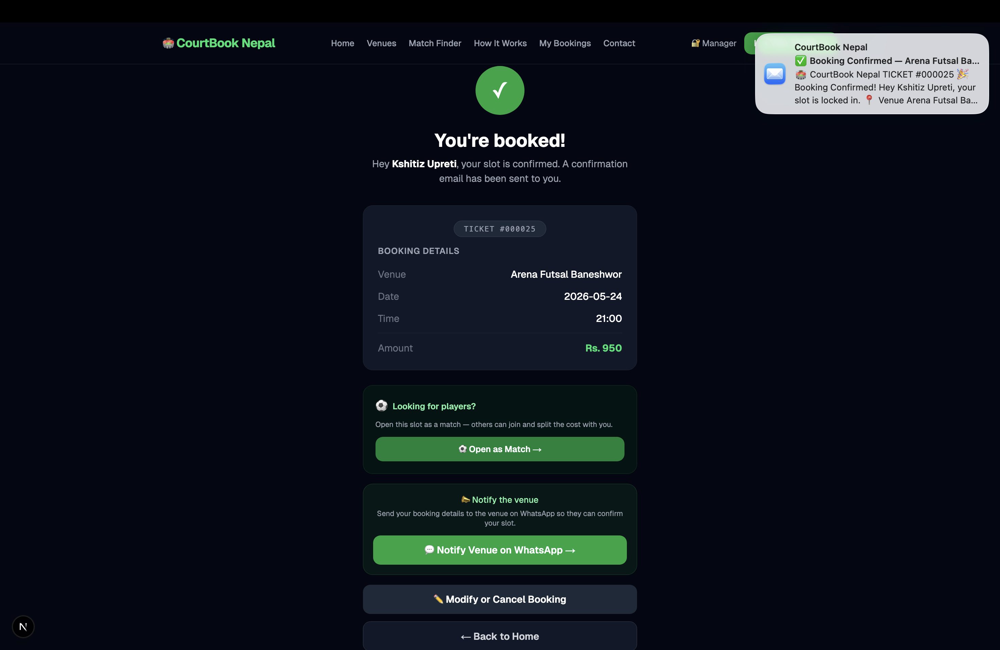
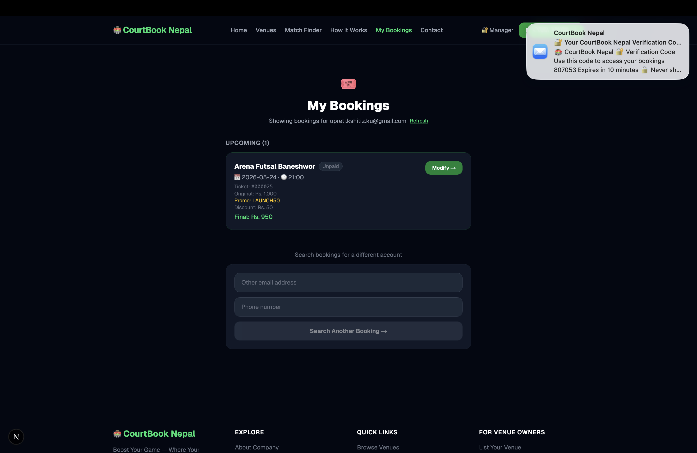
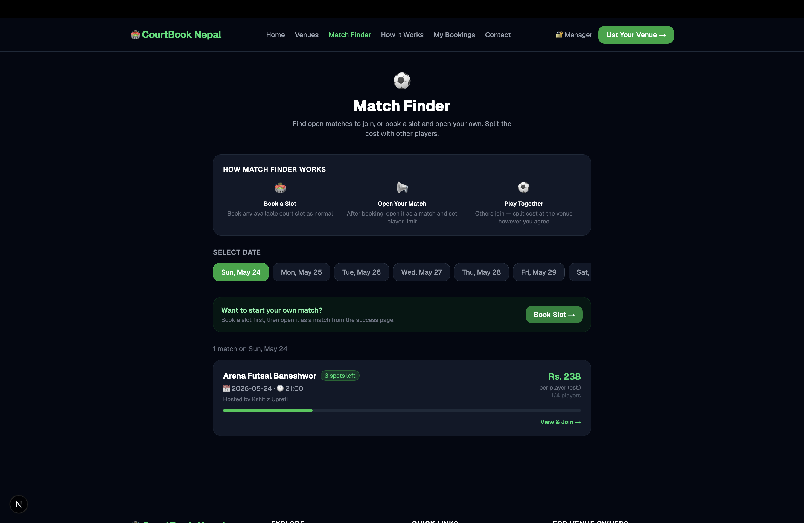
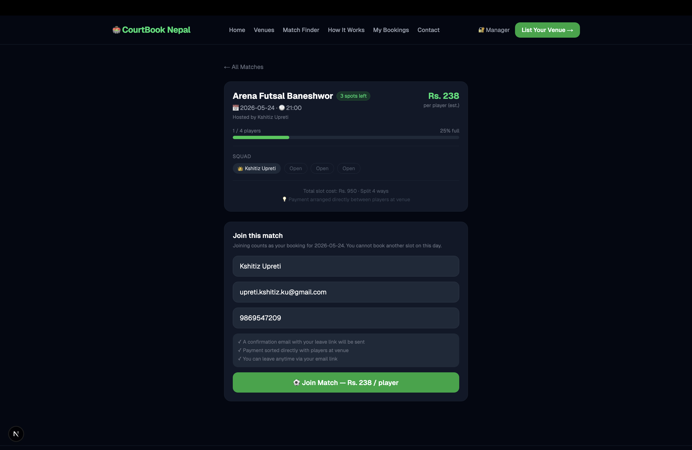
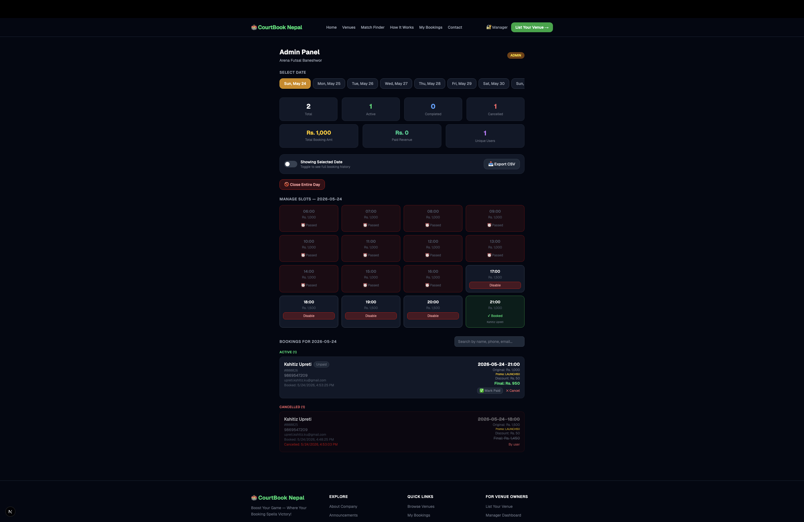
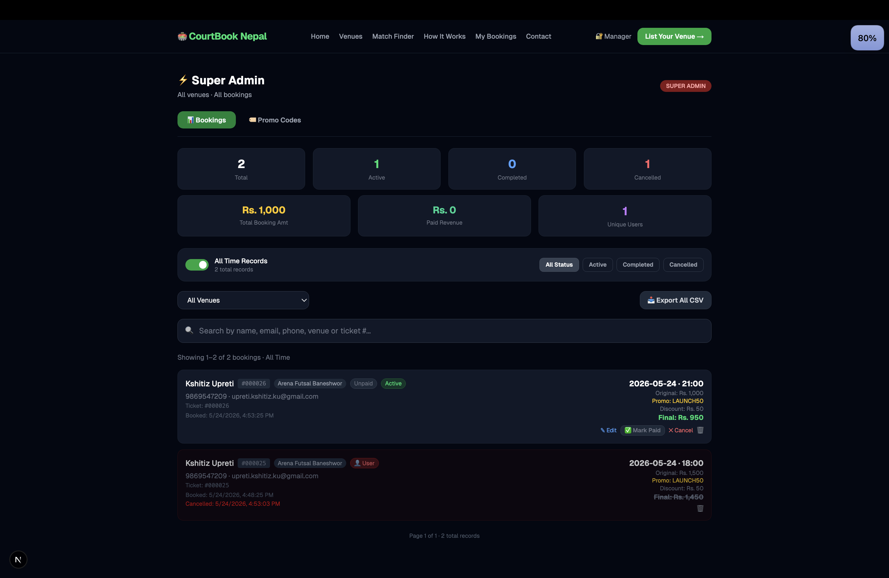

[← Back to all projects](../README.md)

# 🏟️ CourtBook Nepal

### Nepal's First Online Futsal & Cricket Court Booking Platform

Book a slot in under 60 seconds — no login required.

🌐 **Live at:** [courtbooknepal.vercel.app](https://courtbooknepal.vercel.app)

> 🔒 Source code is private. Available for licensing — [get in touch](#-contact).

---

## 📸 Screenshots

### Home — Venue Listing

### Browse Venues

### Venue Detail Page

### Slot Picker & Booking Form

### Booking Confirmed

### My Bookings (OTP Verified)

### Match Finder — Browse Open Matches

### Match Detail — Join a Match

### Venue Manager Panel

### Super Admin Panel

---

## ✨ Features

### 👤 For Players

- Browse futsal and cricket venues across Kathmandu, Lalitpur, Bhaktapur
- Filter by district, area, and sport type — search by name or location
- Real-time slot availability for the next 7 days with peak hour pricing
- Book instantly — name, email, and phone only, no account needed
- Unique sequential ticket number per booking (e.g. `#000001`)
- One active booking per person per day (cookie + device fingerprint + phone/email dedup)
- Email confirmation with WhatsApp notify link and Google Maps directions
- 30-minute reminder email before slot starts
- Game completed email after slot ends with "Book Again" CTA
- Modify booking (date/time) anytime via email link
- Cancel booking anytime via email link
- My Bookings — view all bookings with OTP email verification (48-hour skip)
- Paid/Unpaid status visible per booking

### 🤝 Match Finder

- Open your booked slot for other players to join and split the cost
- Browse open matches by date, venue, and district
- Join as a solo player — pay your per-player share
- Auto-notified when a match is full or cancelled
- Leave a match anytime via email link (host notified)

### 🏟️ For Venue Owners (Manager Panel)

- Free listing — no commission charged
- Login at `/manager` with a unique access key — no username/password
- View bookings by date — Active, Completed, Cancelled shown separately
- Mark bookings as Paid / Unpaid — see Total Booking Amount and Paid Revenue separately
- Disable/enable individual slots or close entire day with one click
- Cancel any booking — cancellation email auto-sent to player
- Search bookings by name, phone, or email
- Export bookings as CSV (includes original price, discount, promo code, paid status)
- All-time booking history toggle

### ⚡ For Super Admin

- All venues and all bookings with pagination (20 per page)
- Filter by venue, date, status — search by name, email, phone, venue, or ticket number
- Edit any active booking — name, email, phone, date, time, promo code
- Mark any booking as Paid / Unpaid — live revenue stats
- Soft cancel (sends email) or hard delete from database
- Promo Codes tab — create flat or percent discount codes with usage limits, expiry, and min price
- Stats: total bookings, active, cancelled, completed, total booking amount, paid revenue, unique users
- Full CSV export with all fields

---

## 🏷️ Promo Code System

- Flat (Rs. off) or Percent (% off) discount types
- Per-code max uses, expiry date, minimum slot price, and max discount cap
- Usage count tracked atomically — safe for concurrent bookings
- Applied code and discount amount visible in all admin views and CSV exports

---

## 📧 Email System (13 automated emails)

| Event                                         | Recipient   |
| --------------------------------------------- | ----------- |
| Booking confirmed                             | Player      |
| Booking modified                              | Player      |
| Cancelled by player / venue / CourtBook Nepal | Player      |
| 30-minute reminder                            | Player      |
| Game completed                                | Player      |
| OTP verification                              | Player      |
| Match join confirmed                          | Player      |
| Player joined your match                      | Host        |
| Player left your match                        | Host        |
| Match is full                                 | Host        |
| Match cancelled                               | All players |

---

## 🔐 Anti-Abuse System

One booking per person per day enforced via:

1. HTTP-only cookie expiring at midnight Nepal time
2. Phone number deduplication against active bookings
3. Email deduplication against active bookings
4. Device fingerprint via FingerprintJS (cross-browser detection)

Cancelling or completing a booking allows immediate re-booking the same day.

---

## 🎫 Ticket Number System

- Sequential format: `#000001`, `#000002`, etc.
- Atomic MongoDB counter — safe under concurrent bookings
- Shown in emails, success page, admin panels, and My Bookings
- Searchable in super admin panel

---

## 🛠 Tech Stack

| Layer            | Technology                       |
| ---------------- | -------------------------------- |
| Framework        | Next.js 16 (App Router)          |
| Database         | MongoDB + Mongoose 9             |
| Styling          | Tailwind CSS v4                  |
| Email            | Nodemailer (Gmail SMTP)          |
| Fingerprinting   | FingerprintJS v5                 |
| Cron / Reminders | cron-job.org                     |
| Deployment       | Vercel                           |
| Timezone         | Nepal Time (UTC+5:45) throughout |

---

## 🗓️ Monetization Roadmap

| Phase        | Timeline   | Model                                               | Target         |
| ------------ | ---------- | --------------------------------------------------- | -------------- |
| Beta         | Now        | Free — grow to 20+ venues                           | Rs. 0          |
| Freemium     | Month 4–6  | Rs. 500/mo per venue — analytics + priority listing | Rs. 10,000/mo  |
| Payments     | Month 7–12 | Khalti/eSewa + 2% platform fee                      | Rs. 50,000+/mo |
| Match Finder | Year 2     | Player matchmaking freemium                         | —              |
| Tournaments  | Year 2     | Tournament hosting + sponsorships                   | —              |

---

## 📩 Contact

> Interested in this platform for your city or want to list your venue?

- 🌐 [courtbooknepal.vercel.app](https://courtbooknepal.vercel.app)
- 📧 [upreti.kshitiz.ku@gmail.com](mailto:upreti.kshitiz.ku@gmail.com)
- 📱 +977 9869547209
- 💬 [WhatsApp](https://wa.me/9779869547209)

---

_Made with ❤️ for Nepal's sporting community_

[← Back to all projects](../README.md)
